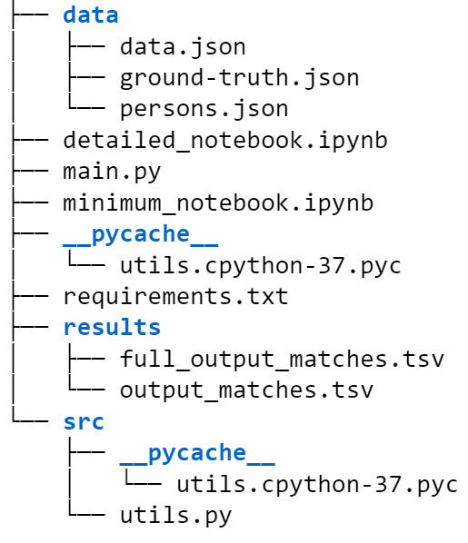

## Task description
The task is to develop an algorithm to disambiguate people contributing to various scientific events (e.g. talks, presentations, sessions). For this, you have to create one profile per person. This profile will have all the contribution from that person (100% recall) and no other contributions from anyone else (100% precision). Please avoid unnecessary duplicates as well as mixing contributions from different scientists despite similar names/focus-areas.

### Datasets
Use the following datasets to solve the problem:

- **data.json**: List of 5086 various contributions, described by several attributes (features), e.g. names, information about the workplace of the author, its geolocation, and focus areas (key topics covered in contribution)
- **ground_truth.json**: "Ground truth" - actual groups of contributions from the data file (each contribution is assigned to a person)
- **persons.json**: The list of unique people.

### Expected outcomes 
The solution should be an algorithm or model which allows us to disambiguate people based on the data.json, by complete the following points:

- Analyze the data 
- Build a model and provide a (minimal) solution 
- Measure the performance of the model (F1, precision, recall, etc)  
- Describe the pros and cons of the solution and how you can improve it if you had more time 
- Explain how your solution scales when applied to millions of data. You donn't have to develop a scalable solution, but you may come up with a proposal.

### Problem statement and initial assumpations
Initially, I thought, I'd need some sort of word sense disambiguation (word sense disambigation is about, within sentences, finding out what entity sense is. For the sentence, "I would like to eat my apple", apple is the entity used to refer food, but not for Apple (entity organisation), due to the action of eat). Therefore, I thought of using spacy or BERT language models (even I did try it for fun, but I've commented them out for now). However, as the columns can be considered just features and no contextual sentences less relevant, it turns out that the problem is more just entity linking of person to specific features to disambiguate different people. 

In other words, as the features are lacking the surrounding context, using more sophsticated (e.g., NLP trasnfer learning via Word2Vec/GloVe/FastTExt or BERT-based) wouldn't improve performance. Further, as the columns can be considered just features and no contextual sentences less relevant, it turns out that the problem is more just entity linking of person to specific features to disambiguate different people. 

Eventually, I didn't go for this approach this as this wouldn't create a model approach we could use just a closest match procedure to name. Therefore, I did encoding tof features using TF-IDF or counter vectorized (NLP feature extractor from sklearn library) for moderate performance. In my understanding, this is less a word sense disambigation task, just entity linking (cf. https://link.springer.com/article/10.1007/s11192-021-03951-w). 

## How to use the repo? 
The directory has the following structure:



In this structure: i) 'scr' folder contains utility functions (see utils.py that prepares the data and returns an cross-vlidatbalble estimator), ii) 'results' folder contains the results for naive validation, iii) 'data' folder, as the title suggests, contain the provided datasets for this task. 

Now, in order to use the repo with, please do the following:

**Step-1**: clone the repo 
```
$ git clone https://github.com/rezacsedu/author_disambiguation.git
```

**Step-2**: Install required dependencies
```
$ cd author_disambiguation/
$ pip3 install -r requirements.txt 
```
**Step-3**: Run the main.py file (from inside the author_disambiguation folder) to see the result
```
$ python3 main.py
```

**Step-4**: Use the detailed notebook for more detail explanations of the steps and results. 

**Step-5**: Conver the standalone notebook as a web app for easy accessibility. 

## Analysis of the solution - pros and cons
Although getting an f1-score of 71% is not good, unfortunately. On a positive note: getting an MCC score of above 85% suggests that the predictions were strongly correlated with the ground truth, yielding a Pearson product-moment correlation coefficient.
Further, this solution has not take into consideration all the features. Besides, names are merged with other features, which shouldn't be the ideal case. We could see if having a name column (i.e., full-name) can give some hints of unique contributions.   

### Improvement suggestions 
I'd like to answer to this from several perspectives like data preprocessing, employing meta- and ensemble learning approaches, improving interpretability, and having other features, etc: 

-- First, based on available data we have, using more sophsticarted preprocessing: we could employ better preprocessing steps to clean the features column. Because only removing some stop words doesn't make the texts clean and meaningful, but also non-English texts that are there in the dataset need to be removed. To the end, having the model trained on comprihensively preprocessed text would certainly boost the performance. 
- Second, employing meta- and ensemble learning: human involvement in the provision and curation of data can make a model's predictions not only susceptible to bias but also erroneous outcomes. Thus, a majority voting-based ensemble from a panel of independent experts can provide a fairer and trustworthy prediction than a single expert, using meta learning approach and come up with ensemble model would certainly improve the permance, as we already saw from the performance analysis (step-4). I'd go for two approaches for this namely: i) blending models - a method of ensembling which uses consensus among estimators to generate final predictions. The idea behind blending is to combine different ML models and use a majority vote or the average predicted probabilities in case of classification to predict the final outcome, ii) stacking models -a method of ensembling that uses meta learning approach. The idea behind stacking is to build a meta model that generates the final prediction using the prediction of multiple base estimators. 
- Third, the approach we have seen so far is pretty-black box approach. So, using some sort of interpretable ML approach (e.g., SHAP, LIME, sensitibity analysis, LRP), we can identify which factors tend the model make a certain prediction, by exposing important terms from the 'feature' column. 
- Fourth, having an abstract column of the speaker would have been useful containing surround contexts, though. Some sort of larger approach with knowledge base, e.g., entity inking (recognizing and disambiguating named entities) to a knowledge base could be helpful, but I'm not sure. To relate this with a more practical entity linking: the current setting is more setting each entity as a unique person. This person entity might be less effective, and the benefits of entity linking might be less that a clustering/classifiering. There are some wiki entity approaches with knowledge base though that link x person with same names to their unique fieldshowever the data doesn't really match with doing that. You need more free text data with the use of names to benefit with these problems, and it isn't really needed as you already have feature columns. 

### On a view to scaling the solution up to millions of records! 
Although providing insights on scaling up my naive solution would depends on how many distinct speakers are in this dataset. Still, scaling the solution for upto millions of records won't be a huge challenges as long as we use some scalable hardware and software infrastructure. For example, processing the records on a commodity hardware or cloud using Spark (or DASK) followed by modelling using Spark ML would give a good basis. By the way, for this, the model might need to retrained on new claaseswhere these match unique speakers. 

This approach I used was just with the dataset provided. Most the preprocessing and methods are reusable but a different hierarchical clustering might be more effective depending on spread of the larger dataset. In such a setting, even utilizing CPUs having parallel cores could be employed. Nevertheless, the training can be distributed across nodes or GPUs (e.g., imagine we're simply training a CNN or Bi-LSTM or transformer model) rather than on CPU cores. To simplify this, I'd: 

- i) first do the initial data processing and feature enginerring on Spark, 
- ii) get the vectros or embeddings using more sophsticated word/sentence embeddings or tarsnformers to be cached locally, 
- iii) training the classifier accross GPUs (or CPUs using Spark or DASK). 

### On recommendation of  using word/sentence embeddings/transformer models  
I'm treating this more as a key encoded feature as the benefits of using a word embedding isn't shown as they have no language context. As mentioned, having an abstract of the talk that might be time to use the word embeddings, and we can use that an as a feature. OTOH, as transformer-based approach already outperform DNN + word/sentence embeddings-based approach in almost all NLP tasks, I'd suggest to go for BERTs in it's differnt domain-specifc variants. However, there are several considerations too: 

- If you really need a faster inference speed but ready to sacrifice some % on prediction metrics, DistilBERT is a reasonable choice for getting the embeddings from. 
- However, if you are looking for the best prediction metrics, you'd be better off with Facebook's RoBERTa. 
- Theoratically, XLNet's permutation based training should handle dependencies well, and might work better in longer-run. 
- Finnaly, using some domain-specific BERT variants such as Bio/SciBERT could be an options too. 
